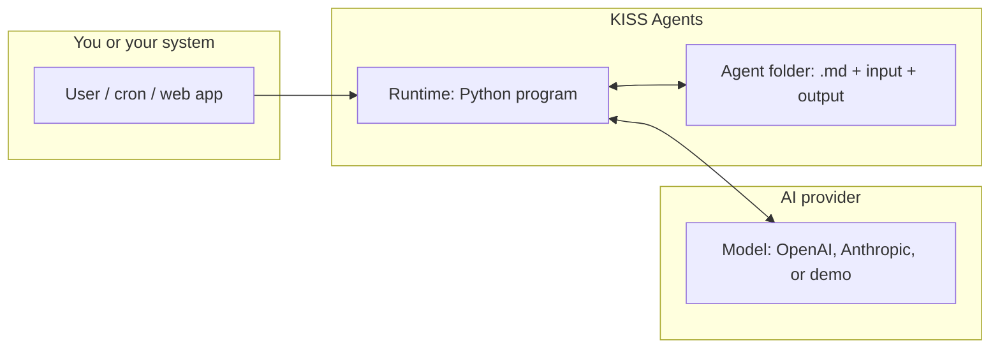
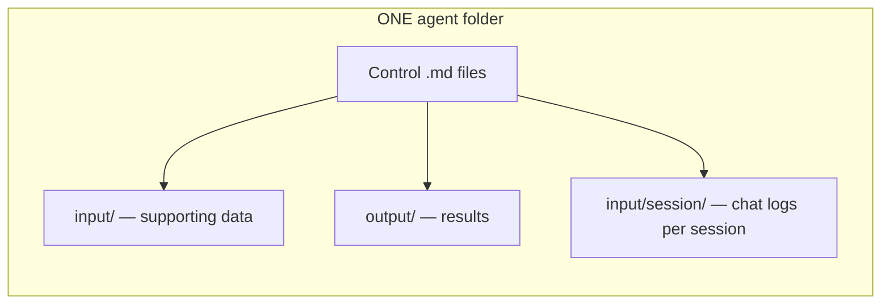
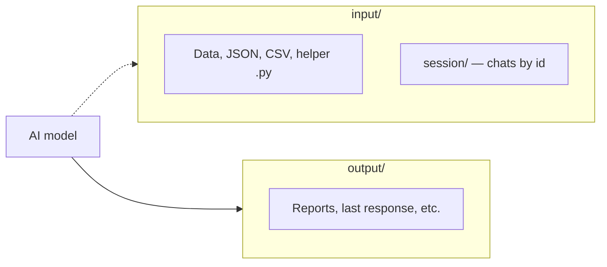
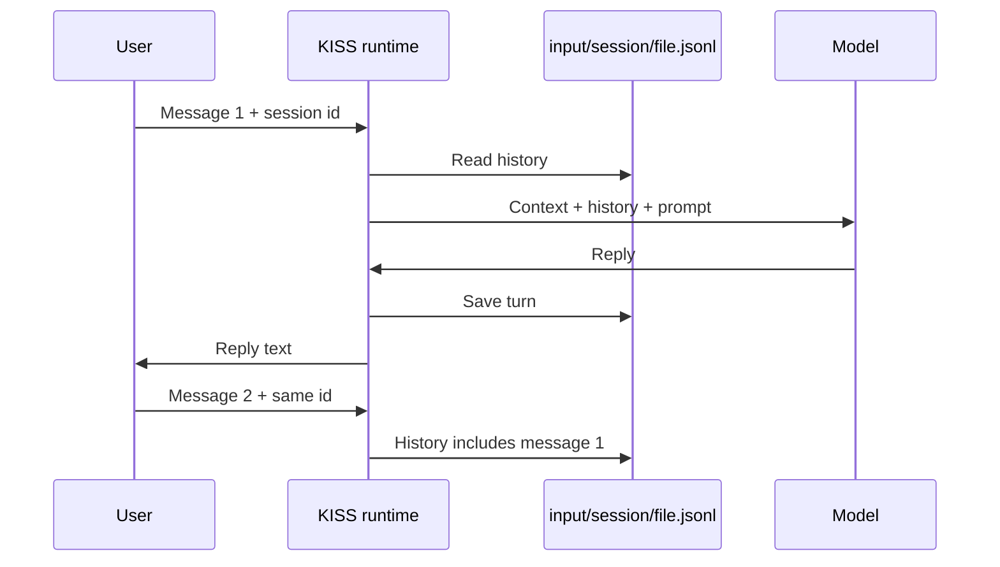
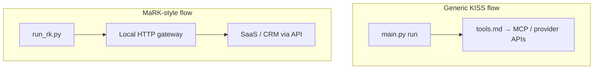
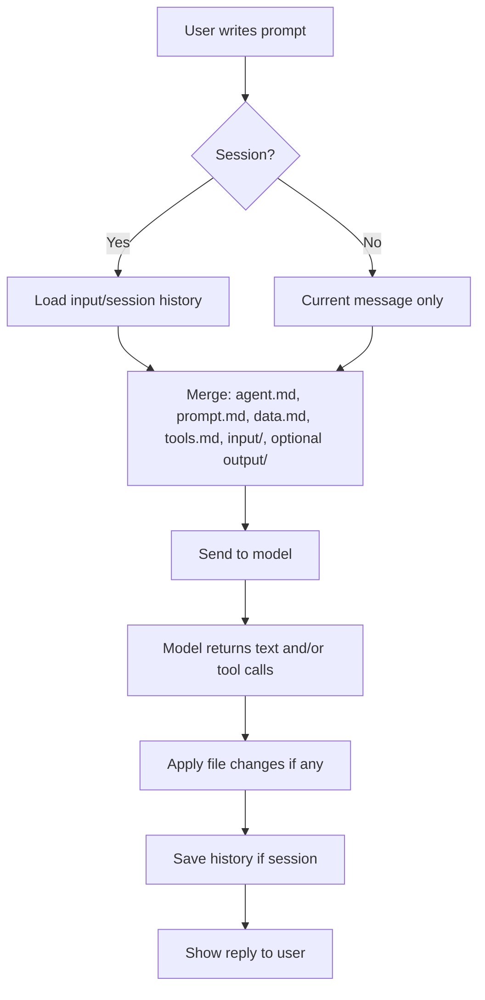

# KISS Agents — Complete tutorial (English)

**Spanish version:** [`ES-tutorial-kiss-agents-para-todos.md`](ES-tutorial-kiss-agents-para-todos.md).

This document is the **English mirror** of that file: **sections 1–13** for a general audience, plus **section 14**, a technical specification for AI systems building or auditing agents.

---

## 1. Start here: what this is in 30 seconds

**KISS Agents** is a way to configure **assistants using text files** (mostly Markdown, `.md`) inside a **folder**.

- That folder is the **brain and memory** of that specific assistant.
- A small program (**runtime**) reads those files, sends them to an **AI model**, and saves responses or file changes the model requests.
- You do not need a product-owned database: **state lives in the folder** (files).

**Simple analogy:** an **employee** who only works from what is in **their filing cabinet** (the agent folder). You prepare instructions and data in files; the runtime **shuttles papers** between the cabinet and the model.



---

## 2. One agent = one folder

Each **agent** is a **directory** with a set of files. Examples shipped in the repo:

| Example folder | One-line idea |
|----------------|---------------|
| `daily-email-summary` | Help produce an **email summary** (demo). |
| `rkiglesias` | **MaRK**-style assistant (buyers / real estate) with business tools. |
| `hopx-demo` | Demo integrating tools via **MCP**. |

Typical path inside the repo:

`KISS Agents/local/examples/<agent-name>/`



---

## 3. Main `.md` files: what each is for

The loader looks for **canonical** Markdown files **by name**. You do not need all of them; missing or **empty** files are skipped.

### Quick table

| File | Plain-language purpose |
|------|-------------------------|
| **`agent.md`** | **Who** the assistant is: name, role, tone, goals in a few lines. |
| **`prompt.md`** | **How it should behave** in detail: rules, flows, dos and don’ts. Often the longest file. |
| **`tools.md`** | **Which external tools** the model may use (e.g. MCP servers). Usually includes a **JSON** block. |
| **`data.md`** | **Context data**, not instructions: product facts, public links, brand names, short legal text. |
| **`done.md`** | **Definition of “finished”** or a checklist so the model knows when a task is closed. |
| **`memory.md`** | **Persistent memory** the flow can update (agreed facts, preferences). Optional; can be filled manually or via special blocks in model output. |
| **`steps.md`** | **Steps** or fixed scripts (checklist-style) if you want a strict sequence. |
| **`schedule.md`** | **When** the agent should wake up automatically (cron-like expression, timezone, instruction to run). |

### A bit more detail (still non-technical)

- **`agent.md`** — First page of the employee handbook: “You are assistant X for company Y; you speak Spanish; you are brief and professional.”
- **`prompt.md`** — Operating procedure: “If the user asks prices, read `data.md`; do not invent numbers; ask only one question at a time when something is missing.”
- **`tools.md`** — Whether it may **call external systems** (calendar, CRM, search). For non-developers: the list of **“phone numbers”** the assistant may dial, in a format the AI understands (often JSON inside Markdown).
- **`data.md`** — **Facts and text** you want always present, separate from behavior rules.
- **`done.md`** — Clear **work cycles**: “When the summary is in `output` and `memory` is updated, consider the task done.”
- **`memory.md`** — **Remember** things across runs (only what you allow). In long chats, helps avoid repeating questions.
- **`steps.md`** — When the process is **always the same** (step 1, 2, 3…).
- **`schedule.md`** — **Automation**: “Every Monday at 9:00 (Madrid), run this.” The real clock is **cron** on the server or a periodic HTTP trigger; KISS does not run a heavy internal daemon.

---

## 4. `input/` and `output/`

### `input/`

- **Input data**: tool definition JSON, sample CSV, helper Python scripts, notes, etc.
- **Important:** **`input/session/`** stores **chat history** per session (one file per session id). The runtime **does not** treat that tree like normal agent context files; it is handled separately for conversations.

### `output/`

- **Results**: last response snapshot, generated reports, files the model requests via `kiss-write`, etc.
- This is where you **look** at what the agent **wrote to disk** after a run.



---

## 5. Three ways to run an agent

Assumes **Python** is installed and paths match your setup (a technical colleague can give exact commands).

### 5.1 One-shot from the terminal (`run`)

You pass a **text instruction**; the agent answers once.

Demo (no paid API):

```bash
cd "KISS Agents/local/runtime"
python3 main.py run ../examples/daily-email-summary "Generate today’s email summary"
```

- **`run`** = run now.
- **`../examples/daily-email-summary`** = which agent folder.
- Quoted text = the user request.

### 5.2 Small web server (`serve`)

A **service** listens; apps or `curl` can trigger **run** over HTTP.

```bash
cd "KISS Agents/local/runtime"
python3 main.py serve
```

Then call **`POST /api/run`** with JSON (usually done by a developer).

### 5.3 Scheduled tick (`tick` + `schedule.md`)

Scans agents with **`schedule.md`** and runs those whose **cron line matches** the current minute (simple comparison).

- Manual: `python3 main.py tick`
- Production: often **system cron** every N minutes hitting the server or running `tick`.

`schedule.md` usually has **cron**, **timezone**, and **what to do** when it fires.

---

## 6. Conversations with memory (“session”)

To **remember** prior messages in the **same chat**, use a **session id** (any label you choose).

```bash
cd "KISS Agents/local/runtime"
python3 main.py run ../examples/rkiglesias "Hi, I’m looking for a flat in Oviedo" --session maria-2026-04
```

Next message:

```bash
python3 main.py run ../examples/rkiglesias "I prefer three bedrooms" --session maria-2026-04
```

Messages are stored under something like:

`.../rkiglesias/input/session/maria-2026-04.jsonl`



---

## 7. Available “brains”: stub, OpenAI, Anthropic

| Mode | What it is | Use case |
|------|------------|----------|
| **Stub (default)** | **Fixed demo** response; no paid API call. | Verify folder layout, cron, files. |
| **OpenAI** | **OpenAI** API (GPT-style models). | Production with advanced tools when configured. |
| **Anthropic** | **Anthropic** API (Claude). | Same, different vendor. |

Deployers set **environment variables** (API keys, etc.). With nothing set, you usually stay on **stub**.

**Non-technical note:** agent **content** (your `.md` files) is independent of provider; switching stub → OpenAI does not force rewriting the whole folder, only **turning on** the mode and keys.

---

## 8. External tools (CRM, search, …)

Two patterns:

### A) Standard KISS (`main.py` + `tools.md`)

- **`tools.md`** declares **MCP** (or related) wiring the **generic runtime** passes to the provider (OpenAI Responses, Anthropic Messages).

### B) HTTP gateway (MaRK example: `run_rk.py`)

The **rkiglesias** agent uses a **Python gateway** that receives “run tool X with this JSON body.”

- Can run in **demo** mode or against a **real SaaS API** (`KISS_SAAS_API_BASE_URL`, etc.).

For business readers: same idea (“the assistant can **do things** in real systems”), different **technical path** than generic `main.py`. See **`CONEXION.md`** in that agent folder.



---

## 9. Illustrative examples

### Example 1: Stub smoke test

1. Terminal in `KISS Agents/local/runtime`.
2. Run: `python3 main.py run ../examples/daily-email-summary "Make a fictitious summary"`
3. Check `examples/daily-email-summary/output/` for `stub-last.md`.

**Takeaway:** folder → runtime → output pipeline works.

### Example 2: Two messages, same session

1. `python3 main.py run ../examples/rkiglesias "Just say hi" --session demo-ana`
2. `python3 main.py run ../examples/rkiglesias "Do you remember my first message?" --session demo-ana`

**Takeaway:** history in **`input/session/demo-ana.jsonl`**. (With stub, replies stay trivial; with a real model, memory matters.)

### Example 3: Scheduled agent

1. Open `examples/daily-email-summary/schedule.md`.
2. See **cron** and timezone.
3. With **server** + **cron** calling `tick` (or HTTP), the agent runs when the schedule matches.

**Takeaway:** KISS relies on **external triggers** + **`schedule.md`** as intent, not an internal heavy scheduler.

### Example 4: `kiss-write` blocks

With a real provider, the model can emit special blocks the runtime turns into **file writes** (e.g. update **`memory.md`**). See [`../local/docs/contracts.md`](../local/docs/contracts.md).

---

## 10. Mental diagram: user message → result



---

## 11. FAQ

**Do I need coding skills to author an agent?**  
Not to edit **`agent.md`**, **`prompt.md`**, **`data.md`**, and much of **`input/`**. You do need help for **Python install**, **cron**, **API keys**, and **servers** (gateway, MCP).

**Where is the agent “code”?**  
In practice, in the **`.md` files and data**. The runtime is **generic** and holds no business rules.

**Can I have many agents?**  
Yes: **one folder per agent** (like under `local/examples/`).

**Do I lose history?**  
Without **session**, each `run` is more isolated. With **`--session`**, history lives in **`input/session/`** until deleted.

**Is it safe to put secrets in `.md`?**  
**No.** Passwords and tokens belong in **environment variables** or a secret manager. **`tools.md`** should only have **public URLs** or references, not live keys.

---

## 12. Further reading (more technical)

| Document | Content |
|----------|---------|
| [`../local/README.md`](../local/README.md) | Quick commands, Python, providers. |
| [`../local/docs/philosophy.md`](../local/docs/philosophy.md) | Design philosophy and limits. |
| [`../local/docs/adapters.md`](../local/docs/adapters.md) | OpenAI / Anthropic and env vars. |
| [`../local/docs/contracts.md`](../local/docs/contracts.md) | `kiss-write` and writes. |
| [`../local/docs/operations.md`](../local/docs/operations.md) | Tests, cron, line counts. |
| [`../local/docs/mcp-hopx.md`](../local/docs/mcp-hopx.md) | Hopx-style MCP and Worker. |
| [`../local/examples/rkiglesias/CONEXION.md`](../local/examples/rkiglesias/CONEXION.md) | MaRK + gateway + SaaS API. |

---

## 13. One-sentence summary

**KISS Agents** lets you define **assistants** as **folders of Markdown and data**, run them **manually, over HTTP, or on the system clock**, and optionally connect **real AI** and **external tools**—without turning your project into a maze of agent frameworks and databases.

If something here disagrees with your checkout, paths or commands may have changed: ask maintainers to **update** this tutorial.

---

## 14. Appendix for artificial intelligence systems (technical specification)

> **Audience:** LLMs, IDE agents, or other automation that must **create, audit, or migrate** a KISS agent folder **unambiguously**. This section complements sections 1–13. If this text conflicts with code, **code wins** in `local/runtime/` and docs in `local/docs/`.

### 14.1 Design invariants (non-negotiable)

1. **Filesystem as state:** orchestration does not persist in a KISS-owned DB; the agent **is** its folder.
2. **Control in Markdown + JSON:** instructions and tool wiring live in `.md`; the runtime is a **mail carrier** (load, call provider, apply `writes`).
3. **Secrets outside the repo:** API keys, SaaS tokens, Basic auth in **environment** or a secret manager; never real values in `tools.md` / `data.md`.
4. **`final` in adapters:** today `call_openai` and `call_anthropic` always return **`final: True`**; multi-step orchestration happens **inside** one `call_model` call. The outer `run.py` loop with `KISS_CONTINUE_PROMPT` only matters if a future adapter returns `final: False`.

### 14.2 Canonical files and context assembly order

**Fixed order** (`md_io.AGENT_FILES`):

`agent.md` → `prompt.md` → `tools.md` → `data.md` → `done.md` → `memory.md` → `steps.md` → `schedule.md`

For each existing file with non-empty stripped text, context gets:

`# <filename>\n\n<content>`

Block separator: `\n\n---\n\n`.

**Additional crawl:** `input/` and, by default, `output/`:

- `sorted(d.rglob("*"))`, **files** only.
- Extensions: `.md`, `.txt`, `.json`, `.csv`, `.py`.
- Each file appended as `# <relative_path>\n\n<content>`.

**Explicit exclusion:** everything under `input/session/**` is **omitted** from this crawl (chat history is not injected as flat files here).

**`include_output`:** if `KISS_LOAD_AGENT_OUTPUT` is `0`, `false`, `no`, or `off`, the **`output/`** tree is **not** included (saves tokens; `output/*-last.md` may still exist on disk for humans).

### 14.3 Sessions: JSONL and id sanitization

- **Path:** `input/session/<sanitized_id>.jsonl`
- **`sanitize_session_id`:** max 128 chars; replace any char not alphanumeric or `._-` with `_`; strip leading/trailing `._`; empty → `default`.
- **Format:** one line = one JSON object per message: `{"role": "user" | "assistant", "content": "<string>"}`
- **Read:** blank or invalid JSON lines skipped; only dicts with string `role` and `content`.
- **Write:** overwrites the whole file with valid messages for the turn.

**`run()` flow:**

1. `msgs = read_session_messages(...)`, then `append` current prompt as `user`.
2. Optional **facts** block (`_user_facts_block`) from **all** `user` messages (name/phone regex) prepended to `ctx` unless `KISS_SESSION_FACTS` is off (`0/false/no/off`).
3. **`_trim_for_api(msgs, max)`:** default `KISS_SESSION_MAX_MESSAGES=48`. If `len(msgs) <= max` or `max <= 0`, no trim. If trimming and first message is `user`, keep **that first** + tail of length `max-1`; else last `max` messages. **JSONL on disk always keeps the full list.**
4. After `call_model`, `append` `assistant` and `write_session_messages`.

**Variables:** `KISS_SESSION_ID` (or CLI `--session`), `KISS_MAX_RUN_TURNS`, `KISS_CONTINUE_PROMPT`, `KISS_REPLY_MAX_CHARS` (truncates displayed message and last-file content).

### 14.4 `run()` loop and `tick_run_fn`

Pseudocode aligned with `run.py`:

```
tools_cfg = resolve_tools_config(agent_dir, normalizer)
msgs = read_session + [user prompt]
for each outer turn (max_turns):
  ctx = load_agent(include_output per env)
  if facts: ctx = facts + "---" + ctx
  api_msgs = trim_for_api(msgs)
  r = call_model(messages=api_msgs, context=ctx, agent_dir, tools_cfg)
  apply_writes(agent_dir, r.writes)
  append assistant to msgs; persist JSONL
  if r.final (default True): return r.message
  append user with KISS_CONTINUE_PROMPT text
return last message
```

**Tick:** `tick_run_fn` calls `run(..., session_id="tick-"+agent_id)` so scheduled runs do not mix with interactive chat for the same agent folder.

### 14.5 `tools.md`: extraction, neutral lists, fallbacks

Implementation: `md_io.resolve_tools_config`.

1. Find the **first** fenced block starting with substring ` ```json `.
2. `json.loads` inner text.
3. Normalize `openai_mcp_tools` and `anthropic_mcp_servers` (dicts with `type` and (`name` or `url`)).
4. **`mcp_servers`:** list of `{name, url?, type?}`. Each valid entry is **duplicated** into:
   - OpenAI: `openai_mcp_tools` ← `{"type": typ, "name", "url"}` if url present
   - Anthropic: `anthropic_mcp_servers` ← entry extended with `url` if present
5. If parse fails and `normalizer(callable)` exists (active provider LLM returns clean JSON), **one** retry.
6. If still failing: write `output/tools-md-invalid.md` and return `{}`.
7. If parse succeeds: apply **`include` / `includes`** (see §14.5.1), **dedupe** MCP entries, and normalize **`anthropic_skills`** (see §14.5.2).

**OpenAI Remote MCP:** `_normalize_openai_mcp_tools` maps to `server_label` + `server_url` when `type` is `mcp`.

### 14.5.1 Shared MCP JSON (`include` / `includes`)

- In the same ` ```json ` block you may set **`include`** (a single string) or **`includes`** (array of strings): paths to `.json` files **relative to the agent folder**, staying inside that tree (no `..` path segments, no absolute paths).
- Each included file is processed recursively up to depth **5**. Only **`mcp_servers`**, **`openai_mcp_tools`**, and **`anthropic_mcp_servers`** are merged from included files; other keys in those files are ignored.
- Merge order: all included branches first (in declaration order), then the lists from the **root** `tools.md` JSON. **Duplicates** with the same lowercased `name` and `url` / `server_url` are dropped (**first** wins).

### 14.5.2 Agent Skills (Anthropic) vs OpenAI

- **Anthropic** [Agent Skills](https://docs.anthropic.com/en/api/skills-guide): optional array **`anthropic_skills`** in the **root** `tools.md` JSON (not merged from `include` files), up to **8** objects: `{ "type": "anthropic" | "custom", "skill_id": "<id>", "version": "latest" | … }`. KISS sends **`container.skills`** on Messages, ensures **code execution** is in `tools` if needed, and adds beta headers `code-execution-2025-08-25` and `skills-2025-10-02`, merged with `KISS_ANTHROPIC_BETA_HEADERS` without duplicates.
- **OpenAI:** there is no equivalent Skills shape in `llm.call_openai`. Reuse **`include`** / **`includes`** to share MCP JSON across agents, and put product-specific instructions in **`prompt.md`** / **`agent.md`**. Capabilities such as Remote MCP and Code Interpreter remain the OpenAI-side options.

### 14.6 OpenAI Responses API (`llm.call_openai`)

- **POST** `https://api.openai.com/v1/responses` with `input`, `model`, `tools`, limits.
- **Chaining:** `previous_response_id` on follow-up requests when the inner loop continues.
- **Polling:** `_oai_poll_terminal` — while `status` ∈ {`queued`, `in_progress`}, `GET /v1/responses/{id}` every `KISS_OPENAI_POLL_INTERVAL` s (default 1.5), up to `KISS_OPENAI_POLL_MAX` (default 400).
- **Inner branches (up to 64 iterations):**
  1. **MCP approval** items → `input` = those items → `continue`.
  2. **Local shell** enabled and `shell_call` present → `input` = `shell_call_output` list → `continue`.
  3. `status` ∈ {`failed`, `cancelled`} → `break`.
  4. `incomplete` and `incomplete_details.reason` ≠ `content_filter` → `input=[]` → `continue`.
  5. `queued` or `in_progress` after poll → `input=[]` → `continue`.
  6. `completed` but `output` contains items with `type` ∈ {`mcp_call`, `function_call`, `custom_tool_call`, `code_interpreter_call`, `shell_call`} and `status` ∈ {`in_progress`, `calling`, `incomplete`} → `input=[]` → `continue`.
  7. `completed` with no pending tool items → `break`.
  8. Any other status → `break` (keep last extracted text).

**Aggregated text:** top-level `output_text` or recursive walk of `output` for `type` ∈ {`output_text`, `text`} with `text` field.

**Declared tools:** shell (hosted `container_auto` or local), optional code interpreter, MCP from `openai_mcp_tools`.

**Key variables (non-exhaustive):**

| Variable | Role |
|----------|------|
| `OPENAI_API_KEY` | Required. |
| `OPENAI_MODEL` | Default `gpt-5.4`. |
| `KISS_OPENAI_INSTRUCTIONS` | Extra system instructions. |
| `KISS_OPENAI_MAX_OUTPUT_TOKENS` | Default `32768`. |
| `KISS_OPENAI_MAX_TOOL_CALLS` | Default `32`. |
| `KISS_OPENAI_DISABLE_SHELL` | `1` disables shell. |
| `KISS_OPENAI_SHELL_MODE` | `hosted` / `local` / `off`… |
| `KISS_OPENAI_ENABLE_CODE_INTERPRETER` | `1` enables CI. |
| `KISS_OPENAI_MCP_AUTO_APPROVE` | Default auto-approves MCP requests. |
| `KISS_OPENAI_STORE_FALSE` | `1` → `store: false`. |
| `KISS_OPENAI_POLL_INTERVAL` / `KISS_OPENAI_POLL_MAX` | Polling. |

### 14.7 Anthropic Messages API (`llm.call_anthropic`)

- Up to **48** iterations.
- `stop_reason == end_turn` → exit loop.
- `stop_reason == tool_use` → for each `tool_use` block:
  - If `name == bash` → run command locally (`KISS_BASH_TIMEOUT`, `KISS_BASH_CWD`, `agent_dir`).
  - **Else** → send `tool_result` with **`is_error: true`** stub (MCP / code_execution should be server-resolved without client tool results, or flow degrades).
- Any other `stop_reason` (e.g. `max_tokens`) → **break** (possible incomplete text).

**Variables:** `ANTHROPIC_API_KEY`, `ANTHROPIC_MODEL`, `KISS_ANTHROPIC_MAX_TOKENS`, `KISS_ANTHROPIC_TOOLS` (subset `bash`, `code_execution`, `mcp`), `KISS_ANTHROPIC_BETA_HEADERS`.

### 14.8 `kiss-write` blocks and `writes`

- **Regex** (Python): multiline pattern in `llm.py` (`_KISS_WRITE_RE`) matching a fenced block that opens with `` ```kiss-write path=<relative_path> `` and closes with `` ``` ``; flags `re.MULTILINE | re.DOTALL`.
- **Safety:** paths with `..` or starting `/` or `\` are **dropped**.
- **Adapter output:** `writes` is a list of `{path, content}`; always includes at least `output/<slug>-last.md` with visible text (kiss-write blocks stripped from that text).
- **`apply_writes`:** writes relative to agent root, mkdir parents.

### 14.9 HTTP server (`http_server.py`)

| Method | Path | Body / notes |
|--------|------|----------------|
| GET | `/health` | `200` minimal JSON. |
| POST | `/api/run` | JSON: `agent_id` (folder under `KISS_AGENTS_ROOT`), `prompt`, optional `session_id`, `max_turns`, `docs` (map relative path → content written **before** run; rejects `..` and absolutes). |
| POST | `/api/tick` | Runs `tick_all` on agents root. |

**Defaults:** `KISS_AGENTS_ROOT` unset → resolved `local/runtime/../examples`. Max body read: 1_000_000 bytes.

### 14.10 `schedule.md` and tick engine (`tick.py`)

**Conditions to consider a `schedule.md`:**

- File must contain substring `**cron**:` (casefold).
- Not paused: if `**paused**:` is `true`, `yes`, `1`, `on` (case-insensitive trim) → skip.

**Parsed fields:**

| Field | Meaning |
|-------|---------|
| `**cron**:` | Five fields: min hour dom mon dow — each `*` or integer. `dow`: 0=Sunday … 6=Saturday (`isoweekday() % 7`). |
| `**tz**:` | IANA zone, e.g. `Europe/Madrid`. Default `UTC`. |
| `**run**:` | Rest of line = **prompt** passed to `run`. |
| `**not_before**:` | `YYYY-MM-DD` or ISO — do not run before that instant in `tz`. |
| `**blackout**:` | `HH:MM-HH:MM` local window in `tz` to skip; if start > end, spans midnight. |

**Execution:** `agent_id` = parent directory name of `schedule.md`. After run, append row to `## History` table.

**Tick session:** see 14.4 (`tick-<agent_id>`).

### 14.11 CLI (`main.py`)

- `python main.py run <agent_folder_path> "<prompt>" [--max-turns N] [--session id]`
- `python main.py tick [--root Path]` — default root `local/examples` via `_ex()`.
- `python main.py serve [--host] [--port]` — defaults `KISS_HTTP_HOST`, `KISS_HTTP_PORT` or `127.0.0.1:8787`.

**Important:** example paths assume **CWD = `local/runtime`**.

### 14.12 MaRK pattern: `run_rk.py` + gateway (outside Responses loop)

- Does **not** use generic `KISS_PROVIDER`.
- **OpenAI Chat Completions** with tools from `input/saas_property_search_tools.json`.
- Each tool call → **POST** `{KISS_HTTP_TOOL_BASE_URL}/kiss-tools/{name}` with JSON body; Basic or Bearer per env.
- Variables: `KISS_HTTP_TOOL_USER`, `KISS_HTTP_TOOL_PASSWORD`, `KISS_HTTP_TOOL_BEARER`, `KISS_HTTP_TOOL_TIMEOUT`, `KISS_HTTP_TOOL_MAX_ROUNDS`, `KISS_HTTP_TOOL_DEBUG`, `KISS_OPENAI_CHAT_MODEL`, `OPENAI_API_KEY`.
- Gateway: `server/kiss_tool_gateway.py`; real SaaS with `KISS_SAAS_API_BASE_URL` + token (see `CONEXION.md`).

Use this pattern for **classic function-calling** against your backend without Responses MCP.

### 14.13 Stub (`model_adapter` with `KISS_PROVIDER=stub`)

- No external APIs.
- Minimal `writes` to `output/stub-last.md`.
- May recognize markers in the last user message (e.g. rkiglesias heartbeat demo).

### 14.14 Checklist: “full capability” agent with `main.py run`

- [ ] **`agent.md`:** identity, language, responsibility bounds.
- [ ] **`prompt.md`:** tool-use rules, tone, multi-turn flows in natural language; when to use `kiss-write` and allowed paths.
- [ ] **`data.md`:** verifiable static facts; separate from instructions.
- [ ] **`tools.md`:** first ` ```json ` block valid; public MCP URLs; no secrets.
- [ ] **`done.md`:** explicit “task closed” criterion for business alignment.
- [ ] **`memory.md`:** starter template if facts must persist across runs.
- [ ] **`steps.md`:** if procedure is strictly sequential.
- [ ] **`schedule.md`:** if automated; test tick with `* * * * *` in v1.
- [ ] **`input/`:** schemas, sample CSV, tool JSON as needed; **do not** commit `input/session/` (usually `.gitignore`).
- [ ] **Test:** stub → real provider; long session with `KISS_SESSION_MAX_MESSAGES`; huge context with `KISS_LOAD_AGENT_OUTPUT=0`.
- [ ] **Document** required env vars in a folder README.

### 14.15 Anti-patterns

- Committing API keys in Markdown.
- Assuming the model auto-sees files outside allowed extensions or outside `input/` crawl rules.
- Putting **stdio** MCP (`uvx …`) directly in `tools.md` without an **HTTP bridge** (use Worker `cloud/code-executor-mcp` or similar; see `local/docs/mcp-hopx.md`).
- Using Anthropic with client-side tool results for non-`bash` tools without implementing executors (today only local `bash`).
- Trusting a single model string as “CRM action done” without verifying tool or gateway outcome.
- Ignoring OpenAI poll / `max_output_tokens` limits (yields `incomplete` or “cut off” text).

### 14.16 Repository map (for AI generating patches)

```
KISS Agents/
  README.md
  docs/                    ← ES/EN tutorials
  local/
    runtime/               ← main.py, run.py, llm.py, md_io.py, model_adapter.py, http_server.py, tick.py
    examples/<agent_id>/   ← one folder = one agent
    docs/                  ← philosophy, adapters, contracts, operations, mcp-hopx
    scripts/               ← cron install
  cloud/code-executor-mcp/ ← HTTP MCP Worker (Hopx, etc.)
```

### 14.17 Cross-references before generating new core code

- [`../local/docs/philosophy.md`](../local/docs/philosophy.md)
- [`../local/docs/adapters.md`](../local/docs/adapters.md)
- [`../local/docs/contracts.md`](../local/docs/contracts.md)
- [`../local/docs/operations.md`](../local/docs/operations.md)
- [`../local/docs/mcp-hopx.md`](../local/docs/mcp-hopx.md)

---
