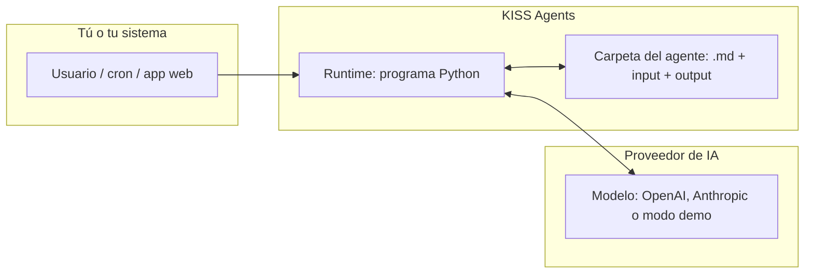
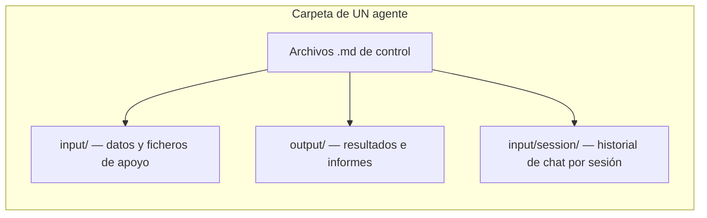
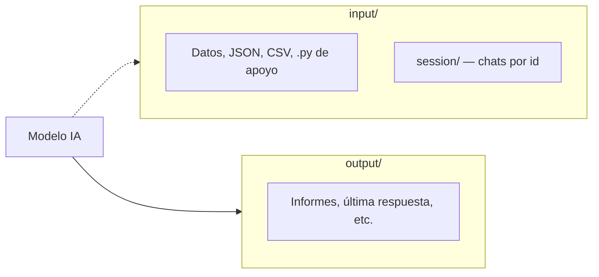
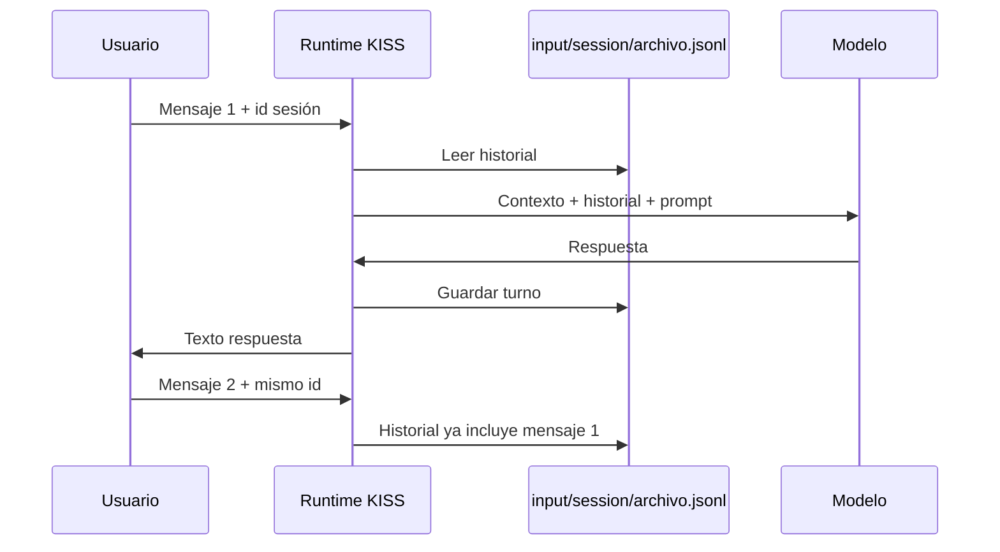
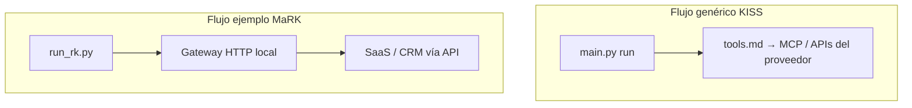
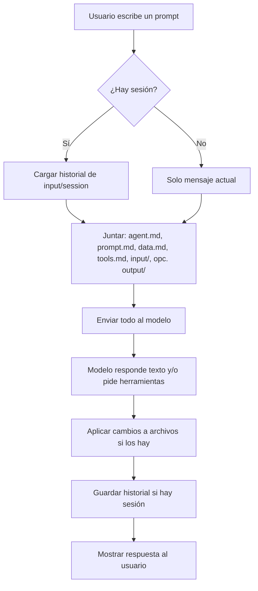

# KISS Agents — Tutorial para todos

**Versión en inglés (misma estructura, secciones 1–14):** [`EN-tutorial-kiss-agents-complete.md`](EN-tutorial-kiss-agents-complete.md).

Esta guía está pensada para **cualquier persona** que quiera entender qué es KISS Agents y cómo se usa, **sin saber programar**. Si en algún momento aparece un comando de terminal, lo explicamos paso a paso. La **sección 14** al final es una **especificación técnica para IA** (crear o auditar agentes al 100% de las capacidades del runtime).

---

## 1. Empieza aquí: de qué va esto en 30 segundos

**KISS Agents** es una forma de tener **asistentes configurados con archivos de texto** (sobre todo Markdown, extensión `.md`) dentro de una **carpeta**.

- Esa carpeta es el **“cerebro” y la memoria”** del asistente para ese caso concreto.
- Un programa pequeño (**runtime**) lee esos archivos, se los envía a un **modelo de inteligencia artificial** y guarda las respuestas o los cambios que el modelo indique.
- No hace falta base de datos propia del producto: **el estado vive en la carpeta** (archivos).

**Analogía simple:** imagina un **empleado** que solo trabaja con lo que hay en **su archivador** (la carpeta del agente). Tú preparas las instrucciones y los datos en carpetas y ficheros; el runtime es quien “lleva y trae” papeles entre el archivador y el modelo.



---

## 2. Un agente = una carpeta

Cada **agente** es **un directorio** con un conjunto de archivos. Ejemplos que ya vienen en el proyecto:

| Carpeta de ejemplo | Idea en una frase |
|--------------------|-------------------|
| `daily-email-summary` | Ayudar a preparar un **resumen de correo** (demo). |
| `rkiglesias` | Asistente tipo **MaRK** (compradores / inmobiliaria) con herramientas de negocio. |
| `hopx-demo` | Demo de integración con herramientas vía **MCP**. |

La ruta típica dentro del repo es:

`KISS Agents/local/examples/<nombre-del-agente>/`



---

## 3. Los archivos `.md` principales: para qué sirve cada uno

El programa que carga el agente busca **por nombre** varios Markdown “canónicos”. No tienes que usarlos todos; si un archivo **no existe** o está **vacío**, simplemente se omite.

### Tabla rápida

| Archivo | Para qué sirve (lenguaje sencillo) |
|---------|-----------------------------------|
| **`agent.md`** | **Quién es** el asistente: nombre, rol, tono y objetivos en pocas líneas. Es la “ficha de presentación” del agente. |
| **`prompt.md`** | **Cómo debe comportarse** en detalle: reglas, flujos, qué puede y qué no debe hacer. Suele ser el archivo más largo. |
| **`tools.md`** | **Qué herramientas externas** puede usar el modelo (por ejemplo conexión a servidores MCP). Suele incluir un bloque **JSON** con la configuración técnica. |
| **`data.md`** | **Datos de contexto** que no son instrucciones: producto, enlaces públicos, nombres de marca, textos legales breves, etc. |
| **`done.md`** | **Criterio de “trabajo terminado”** o checklist para que el modelo sepa cuándo dar por cerrada una tarea. |
| **`memory.md`** | **Memoria persistente** que el propio flujo puede ir actualizando (hechos acordados, preferencias). Es opcional y se puede rellenar a mano o vía bloques especiales en la respuesta del modelo. |
| **`steps.md`** | **Pasos** o guiones fijos (tipo checklist) si quieres que el agente siga una secuencia clara. |
| **`schedule.md`** | **Cuándo** debe “despertarse” el agente de forma automática (expresión tipo cron, zona horaria, instrucción a ejecutar). |

### Un poco más de detalle (sin tecnicismos)

- **`agent.md`**  
  Piensa en la **primera página** del manual del empleado: “Eres el asistente X de la empresa Y; hablas en español; eres breve y profesional”.

- **`prompt.md`**  
  Es el **procedimiento operativo**: “Si el usuario pregunta por precios, mira en data.md; no inventes cifras; si falta un dato, pregunta solo una cosa cada vez”.

- **`tools.md`**  
  Aquí se dice **si puede llamar a sistemas externos** (calendario, CRM, búsqueda, etc.). Para alguien no técnico: es la lista de **“teléfonos”** a los que el asistente puede marcar, definida en un formato que entiende la IA (a menudo JSON dentro del mismo Markdown).

- **`data.md`**  
  **Hechos y textos** que quieres que el modelo tenga siempre presentes sin mezclarlos con las reglas de comportamiento.

- **`done.md`**  
  Útil cuando quieres **ciclos de trabajo** claros: “Cuando tengas el resumen en output y memory actualizado, considera la tarea cerrada”.

- **`memory.md`**  
  Para **recordar** cosas entre ejecuciones (siempre dentro de lo que tú decidas guardar). En conversaciones largas también puede ayudar a no repetir preguntas.

- **`steps.md`**  
  Cuando el proceso es **siempre el mismo** (paso 1, 2, 3…).

- **`schedule.md`**  
  Para **automatizar**: “cada lunes a las 9:00 (Madrid), ejecuta esto”. El reloj real lo pone **cron** en el servidor o un disparador HTTP periódico; KISS no mantiene un daemon complicado.

---

## 4. Carpetas `input/` y `output/`

### `input/`

- Aquí van **datos de entrada**: JSON de definición de herramientas, CSV de ejemplo, scripts de ayuda en Python, notas, etc.
- **Importante:** la subcarpeta **`input/session/`** guarda el **historial de chat** por sesión (un fichero por id de sesión). El runtime **no** mezcla ese historial con el resto del contexto como si fuera un archivo normal de lectura del agente; lo gestiona aparte para las conversaciones.

### `output/`

- Aquí aparecen **resultados**: última respuesta resumida, informes generados, archivos que el modelo pida escribir con la convención `kiss-write`, etc.
- Es el sitio donde **miras** lo que el agente “dejó hecho” en disco después de una ejecución.



---

## 5. Tres formas de “ejecutar” un agente

Todo esto asume que tienes **Python instalado** y estás en la carpeta correcta del proyecto (tu compañero técnico puede dejarte el comando exacto).

### 5.1. Una sola vez desde la terminal (“run”)

**Idea:** le das una **instrucción en texto** y el agente responde una vez.

Ejemplo (modo demo, sin gastar API de pago):

```bash
cd "KISS Agents/local/runtime"
python3 main.py run ../examples/daily-email-summary "Genera el resumen de correo de hoy"
```

- **`run`** = ejecutar ahora.
- **`../examples/daily-email-summary`** = qué carpeta de agente usar.
- El texto entre comillas = lo que “pide” el usuario.

### 5.2. Servidor web pequeño (“serve”)

**Idea:** dejas un **servicio** escuchando; otras aplicaciones o `curl` pueden pedir **ejecutar un agente** por HTTP.

```bash
cd "KISS Agents/local/runtime"
python3 main.py serve
```

Luego, por ejemplo, se puede llamar a la API de **run** con un JSON (esto suele hacerlo un desarrollador desde otra herramienta).

### 5.3. Tick programado (“tick” + `schedule.md`)

**Idea:** recorrer agentes que tengan **`schedule.md`** y ejecutar los que toquen **según la hora** (comparación sencilla con cron).

- Puede lanzarse **a mano**: `python3 main.py tick`
- O en **producción** suele combinarse con **cron** que cada X minutos llame al servidor o ejecute `tick`.

En `schedule.md` suele haber campos como **cron**, **zona horaria** y **qué debe hacer** el agente cuando salta la alarma.

---

## 6. Conversaciones con memoria (“sesión”)

Si quieres que el asistente **recuerde** los mensajes anteriores **del mismo chat**, usas un **identificador de sesión** (un nombre o código que tú eliges).

Ejemplo:

```bash
cd "KISS Agents/local/runtime"
python3 main.py run ../examples/rkiglesias "Hola, busco piso en Oviedo" --session maria-2026-04
```

La próxima vez:

```bash
python3 main.py run ../examples/rkiglesias "Prefiero tres dormitorios" --session maria-2026-04
```

Los mensajes se guardan en algo como:

`.../rkiglesias/input/session/maria-2026-04.jsonl`

Así, **María** mantiene el hilo aunque tú cierres la terminal entre una frase y otra.



---

## 7. “Cerebros” disponibles: stub, OpenAI y Anthropic

| Modo | Qué es | Para qué sirve |
|------|--------|----------------|
| **Stub (por defecto)** | Respuesta **fija de demostración**, sin llamar a internet a un modelo de pago. | Probar que la carpeta, el cron y los archivos están bien. |
| **OpenAI** | Usa la API de **OpenAI** (modelos tipo GPT). | Producción con herramientas avanzadas según configuración. |
| **Anthropic** | Usa la API de **Anthropic** (modelos Claude). | Igual, otro proveedor. |

Quien despliegue el sistema configura **variables de entorno** (pequeñas “palabras clave” con la clave API, etc.). Si no configuras nada, suele quedarse en **stub**.

**Importante para no técnicos:** el **contenido** del agente (tus `.md`) es independiente del proveedor; cambiar de stub a OpenAI no obliga a reescribir toda la carpeta, solo a **activar** el modo y las claves.

---

## 8. Herramientas externas (CRM, búsquedas, etc.)

Hay **dos ideas** que conviene no mezclar:

### A) Herramientas vía **KISS estándar** (`main.py` + `tools.md`)

- En **`tools.md`** se declara el JSON de **MCP** u otras integraciones que el **runtime genérico** sabe pasar al proveedor (OpenAI Responses, Anthropic Messages).
- Sirve cuando tu integración encaja con ese modelo.

### B) Herramientas vía **gateway HTTP** (ejemplo MaRK: `run_rk.py`)

El agente **rkiglesias** tiene un flujo especial documentado en su carpeta:

- Un **servidor gateway** en Python recibe llamadas tipo “ejecuta la herramienta X con estos datos”.
- Ese gateway puede estar en **modo demo** o conectado a la **API real** del producto (variables `KISS_SAAS_API_BASE_URL`, etc.).

Para alguien de negocio: es el mismo concepto (“el asistente puede **hacer cosas** en sistemas reales”), pero el **camino técnico** es distinto al del `main.py` genérico. Los detalles están en **`CONEXION.md`** dentro de esa carpeta de agente.



---

## 9. Ejemplos ilustrativos

### Ejemplo 1: Probar sin gastar API (stub)

**Objetivo:** ver que todo “enciende”.

1. Abre terminal en `KISS Agents/local/runtime`.
2. Ejecuta:

   `python3 main.py run ../examples/daily-email-summary "Haz un resumen ficticio"`

3. Mira en `examples/daily-email-summary/output/` si apareció un archivo tipo `stub-last.md`.

**Qué aprendes:** el **ciclo carpeta → runtime → respuesta en output** funciona.

---

### Ejemplo 2: Misma conversación en dos mensajes (sesión)

**Objetivo:** ver la **memoria de chat** entre dos frases.

1. `python3 main.py run ../examples/rkiglesias "Solo di hola" --session demo-ana`
2. `python3 main.py run ../examples/rkiglesias "¿Recuerdas mi primer mensaje?" --session demo-ana`

**Qué aprendes:** el segundo mensaje puede usar el historial guardado en **`input/session/demo-ana.jsonl`**.

*(Si el modelo está en stub, la respuesta seguirá siendo muy simple; con OpenAI/Anthropic la diferencia se nota más.)*

---

### Ejemplo 3: Agente que “debe despertarse” solo

**Objetivo:** entender **`schedule.md`**.

1. Abre `examples/daily-email-summary/schedule.md` (o el agente que uses).
2. Verás algo como una expresión **cron** y una zona horaria.
3. Con el **servidor** en marcha y **cron** del sistema llamando a `tick` (o el endpoint equivalente), en la hora indicada el sistema intentará ejecutar la instrucción definida.

**Qué aprendes:** KISS **no** es un cron interno pesado; se apoya en **disparadores externos** + **`schedule.md`** como calendario de intenciones.

---

### Ejemplo 4: Escribir en memoria o en informes (`kiss-write`)

Cuando el proveedor de IA está configurado para ello, el modelo puede incluir en su respuesta bloques especiales que el runtime traduce en **“escribe este archivo con este contenido”**. Eso permite actualizar **`memory.md`** o crear informes en **`output/`** sin que tú copies y pegues a mano.

Los detalles del formato están en la documentación técnica de **contratos** (`local/docs/contracts.md`).

---

## 10. Diagrama mental: de un mensaje del usuario al resultado



---

## 11. Preguntas frecuentes

**¿Necesito saber programar para redactar un agente?**  
No para **editar** `agent.md`, `prompt.md`, `data.md` y muchos contenidos de `input/`. Sí hace falta ayuda técnica para **instalar Python**, **cron**, **claves API** y **servidores** (gateway, MCP).

**¿Dónde está el “código” del agente?**  
En la práctica, **en los `.md` y los datos** de la carpeta. El runtime es **genérico** y no contiene reglas de tu negocio.

**¿Puedo tener muchos agentes?**  
Sí: **una carpeta por agente** (como los ejemplos bajo `local/examples/`).

**¿Se pierde el historial?**  
Si no usas **sesión**, cada `run` es más “aislado”. Con **`--session`**, el historial vive en **`input/session/`** hasta que alguien borre esos archivos.

**¿Es seguro poner secretos en los .md?**  
**No.** Contraseñas y tokens deben ir en **variables de entorno** o gestores de secretos. En `tools.md` solo deberían aparecer **URLs públicas** o referencias; las claves, fuera del repo.

---

## 12. Dónde seguir (documentación más técnica)

| Documento | Contenido |
|-----------|-----------|
| [`../local/README.md`](../local/README.md) | Comandos rápidos, Python, proveedores. |
| [`../local/docs/philosophy.md`](../local/docs/philosophy.md) | Filosofía y límites del diseño. |
| [`../local/docs/adapters.md`](../local/docs/adapters.md) | OpenAI / Anthropic y variables. |
| [`../local/docs/contracts.md`](../local/docs/contracts.md) | Formato `kiss-write` y writes. |
| [`../local/docs/operations.md`](../local/docs/operations.md) | Pruebas, cron, conteo de líneas. |
| [`../local/docs/mcp-hopx.md`](../local/docs/mcp-hopx.md) | MCP tipo Hopx y Worker. |
| [`../local/examples/rkiglesias/CONEXION.md`](../local/examples/rkiglesias/CONEXION.md) | MaRK + gateway + API SaaS. |

---

## 13. Resumen en una frase

**KISS Agents** te permite definir **asistentes** como **carpetas de Markdown y datos**, ejecutarlos **a mano, por HTTP o con el reloj del sistema**, y opcionalmente conectarlos a **IA real** y **herramientas externas**, sin convertir tu proyecto en un monstruo de librerías y bases de datos solo para orquestar agentes.

Si algo de esta guía no cuadra con lo que ves en tu copia del repositorio, puede haber cambiado una ruta o un nombre de comando: pide a quien mantenga el proyecto que **actualice** este tutorial o la sección afectada.

---

## 14. Apéndice para sistemas de inteligencia artificial (especificación técnica)

> **Audiencia:** modelos de lenguaje, agentes de IDE u otra IA que deba **crear, auditar o migrar** una carpeta de agente KISS **sin ambigüedad**. Este apartado complementa las secciones 1–13. Si hay conflicto entre este texto y el código, **prevalece el código** en `local/runtime/` y la documentación en `local/docs/`.

### 14.1 Invariantes del diseño (no negociables)

1. **Estado en filesystem:** la orquestación no persiste en una BBDD propia de KISS; el agente es su carpeta.
2. **Control en Markdown + JSON:** instrucciones y wiring de tools en `.md`; el runtime actúa como **cartero** (carga, llama al proveedor, aplica `writes`).
3. **Secretos fuera del repo:** claves API, tokens SaaS y Basic auth en **variables de entorno** o secret manager; nunca en `tools.md` / `data.md` con valor real.
4. **`final` en adaptadores:** hoy `call_openai` y `call_anthropic` devuelven **`final: True`** siempre; la orquestación multi-paso del proveedor ocurre **dentro** de una sola llamada a `call_model`. El bucle externo de `run.py` con `KISS_CONTINUE_PROMPT` solo aplica si en el futuro un adaptador devuelve `final: False`.

### 14.2 Archivos canónicos y orden de ensamblado del contexto

**Orden fijo** (`md_io.AGENT_FILES`):

`agent.md` → `prompt.md` → `tools.md` → `data.md` → `done.md` → `memory.md` → `steps.md` → `schedule.md`

Para cada fichero existente con texto no vacío (tras `strip`), se añade al contexto como:

`# <nombre_fichero>\n\n<contenido>`

Separador entre bloques: `\n\n---\n\n`.

**Crawl adicional:** subdirectorios `input/` y, por defecto, `output/`:

- Recorrido `sorted(d.rglob("*"))`, solo **archivos**.
- Extensiones incluidas: `.md`, `.txt`, `.json`, `.csv`, `.py`.
- Cada archivo se añade como `# <ruta_relativa>\n\n<contenido>`.

**Exclusión explícita:** todo lo bajo `input/session/**` se **omite** en este crawl (el historial de chat no se mezcla aquí).

**Parámetro `include_output`:** si `KISS_LOAD_AGENT_OUTPUT` es `0`, `false`, `no` u `off`, **no** se incluye el árbol `output/` en el contexto (ahorra tokens; sigue existiendo `output/*-last.md` en disco para inspección humana).

### 14.3 Sesiones: JSONL y saneamiento de id

- **Ruta:** `input/session/<id_sanitizado>.jsonl`
- **`sanitize_session_id`:** máximo 128 caracteres; reemplazar cualquier carácter que no sea alfanumérico o `._-` por `_`; recortar `._` en extremos; si queda vacío → `default`.
- **Formato:** una línea = un objeto JSON por mensaje:

  `{"role": "user" | "assistant", "content": "<string>"}`

- **Lectura:** líneas vacías o JSON inválido se ignoran; solo se aceptan dicts con `role` y `content` string.
- **Escritura:** reescribe el fichero completo con los mensajes válidos del turno.

**Flujo en `run()`:**

1. `msgs = read_session_messages(...)`, luego `append` del prompt actual como `user`.
2. Opcional: bloque **hechos** (`_user_facts_block`) a partir de **todos** los mensajes `user` (regex nombre/teléfono) prepuesto a `ctx` si `KISS_SESSION_FACTS` no está desactivado (`0/false/no/off`).
3. **`_trim_for_api(msgs, max)`:** por defecto `KISS_SESSION_MAX_MESSAGES=48`. Si `len(msgs) <= max` o `max <= 0`, no se recorta. Si hay que recortar y el primer mensaje es `user`, se conserva **ese primero** + la cola de longitud `max-1`; si no, últimos `max` mensajes. El JSONL en disco conserva **siempre** la lista completa.
4. Tras `call_model`, se hace `append` del `assistant` y `write_session_messages`.

**Variables:** `KISS_SESSION_ID` (alternativa CLI `--session`), `KISS_MAX_RUN_TURNS`, `KISS_CONTINUE_PROMPT`, `KISS_REPLY_MAX_CHARS` (truncado del **mensaje mostrado** y escrito en last).

### 14.4 Bucle `run()` y `tick_run_fn`

Pseudocódigo alineado con `run.py`:

```
tools_cfg = resolve_tools_config(agent_dir, normalizer)
msgs = read_session + [user prompt]
for cada turno externo (max_turns):
  ctx = load_agent(include_output según env)
  si facts: ctx = facts + "---" + ctx
  api_msgs = trim_for_api(msgs)
  r = call_model(messages=api_msgs, context=ctx, agent_dir, tools_cfg)
  apply_writes(agent_dir, r.writes)
  append assistant a msgs; persistir JSONL
  si r.final (default True): return r.message
  append user con texto KISS_CONTINUE_PROMPT
return último mensaje
```

**Tick:** `tick_run_fn` invoca `run(..., session_id="tick-"+agent_id)` para que las ejecuciones programadas no mezclen historial con chats interactivos del mismo agente.

### 14.5 `tools.md`: extracción, listas neutras y fallbacks

Implementación: `md_io.resolve_tools_config`.

1. Localizar el **primer** bloque fenced que empiece por la subcadena ` ```json ` (desde el primer backtick-triple).
2. `json.loads` del interior.
3. Normalizar listas `openai_mcp_tools` y `anthropic_mcp_servers` (solo dicts con `type` y (`name` o `url`)).
4. **`mcp_servers`:** lista de dicts `{name, url?, type?}`. Cada entrada válida se **duplica** en:
   - OpenAI: `openai_mcp_tools` ← `{"type": typ, "name", "url"}` si hay url
   - Anthropic: `anthropic_mcp_servers` ← entrada ampliada con `url` si existe
5. Si el parse falla y existe `normalizer(callable)` (LLM del proveedor activo que devuelve JSON limpio), **una** reintento.
6. Si sigue fallando: crear `output/tools-md-invalid.md` y retornar `{}` (sin tools MCP declaradas).

**OpenAI Remote MCP:** `_normalize_openai_mcp_tools` exige mapeo a `server_label` + `server_url` cuando `type` es `mcp`.

### 14.6 OpenAI Responses API (`llm.call_openai`)

- **POST** `https://api.openai.com/v1/responses` con `input`, `model`, `tools`, y límites.
- **Cadena:** `previous_response_id` en peticiones subsiguientes cuando el bucle interno continúa.
- **Polling:** `_oai_poll_terminal` — mientras `status` ∈ {`queued`, `in_progress`}, `GET /v1/responses/{id}` cada `KISS_OPENAI_POLL_INTERVAL` s (default 1.5), hasta `KISS_OPENAI_POLL_MAX` iteraciones (default 400).
- **Ramas del bucle (hasta 64 vueltas):**
  1. Si hay items de **aprobación MCP** (`mcp_approval_response`), `input` = esos items y `continue`.
  2. Si **shell local** habilitado y hay `shell_call`, `input` = lista de `shell_call_output` y `continue`.
  3. Si `status` ∈ {`failed`, `cancelled`} → `break`.
  4. Si `incomplete` y `incomplete_details.reason` ≠ `content_filter` → `input=[]`, `continue`.
  5. Si `queued` o `in_progress` tras poll → `input=[]`, `continue`.
  6. Si `completed` pero en `output` hay ítems con `type` ∈ {`mcp_call`, `function_call`, `custom_tool_call`, `code_interpreter_call`, `shell_call`} y `status` ∈ {`in_progress`, `calling`, `incomplete`} → `input=[]`, `continue`.
  7. Si `completed` sin pendientes → `break`.
  8. Cualquier otro estado → `break` (conservar último texto extraído).

**Texto agregado:** `output_text` top-level o recorrido recursivo de `output` buscando `type` ∈ {`output_text`, `text`} con campo `text`.

**Herramientas declaradas:** shell (hosted con `container_auto` o local), code interpreter opcional, MCP desde `openai_mcp_tools`.

**Variables clave (lista no exhaustiva):**

| Variable | Rol |
|----------|-----|
| `OPENAI_API_KEY` | Obligatoria. |
| `OPENAI_MODEL` | Default `gpt-5.4`. |
| `KISS_OPENAI_INSTRUCTIONS` | Sufijo de sistema extra. |
| `KISS_OPENAI_MAX_OUTPUT_TOKENS` | Default `32768`. |
| `KISS_OPENAI_MAX_TOOL_CALLS` | Default `32`. |
| `KISS_OPENAI_DISABLE_SHELL` | `1` sin shell. |
| `KISS_OPENAI_SHELL_MODE` | `hosted` / `local` / `off`… |
| `KISS_OPENAI_ENABLE_CODE_INTERPRETER` | `1` activa CI. |
| `KISS_OPENAI_MCP_AUTO_APPROVE` | Default aprueba requests MCP. |
| `KISS_OPENAI_STORE_FALSE` | `1` → `store: false`. |
| `KISS_OPENAI_POLL_INTERVAL` / `KISS_OPENAI_POLL_MAX` | Poll. |

### 14.7 Anthropic Messages API (`llm.call_anthropic`)

- Hasta **48** iteraciones.
- `stop_reason == end_turn` → salir del bucle.
- `stop_reason == tool_use` → por cada bloque `tool_use`:
  - Si `name == bash` → ejecutar comando local (`KISS_BASH_TIMEOUT`, `KISS_BASH_CWD`, `agent_dir`).
  - **Else** → enviar `tool_result` con **`is_error: true`** y mensaje indicando que no está implementado en cliente (MCP / code_execution deben resolverse en servidor sin requerir resultados locales, o el flujo se degrada).
- Cualquier otro `stop_reason` (p. ej. `max_tokens`) → **break** (posible texto incompleto).

**Variables:** `ANTHROPIC_API_KEY`, `ANTHROPIC_MODEL`, `KISS_ANTHROPIC_MAX_TOKENS`, `KISS_ANTHROPIC_TOOLS` (subconjunto `bash`, `code_execution`, `mcp`), `KISS_ANTHROPIC_BETA_HEADERS`.

### 14.8 Bloques `kiss-write` y `writes`

- **Regex** (Python): `^```kiss-write\s+path=(\S+)\s*\r?\n(.*?)^```\s*` con `MULTILINE|DOTALL`.
- **Seguridad:** rutas con `..` o que empiecen por `/` o `\` se **descartan**.
- **Resultado del adaptador:** `writes` es lista de `{path, content}`; siempre incluye al menos `output/<slug>-last.md` con el texto visible (sin bloques kiss-write extraídos).
- **`apply_writes`:** escribe relativo a la raíz del agente, creando directorios.

### 14.9 Servidor HTTP (`http_server.py`)

| Método | Ruta | Cuerpo / notas |
|--------|------|----------------|
| GET | `/health` | `200` JSON mínimo. |
| POST | `/api/run` | JSON: `agent_id` (carpeta bajo `KISS_AGENTS_ROOT`), `prompt`, opcional `session_id`, `max_turns`, `docs` (mapa ruta relativa → contenido a escribir **antes** del run; rechaza `..` y absolutos). |
| POST | `/api/tick` | Ejecuta `tick_all` sobre root de agentes. |

**Defaults:** `KISS_AGENTS_ROOT` si no está definido → `local/runtime/../examples` resuelto. Tamaño máximo de body leído: 1_000_000 bytes.

### 14.10 `schedule.md` y motor de tick (`tick.py`)

**Condiciones para considerar un `schedule.md`:**

- Debe existir la cadena `**cron**:` (casefold) en el fichero.
- No estar en pausa: si `**paused**:` es `true`, `yes`, `1`, `on` (case-insensitive trim) → se omite.

**Campos parseados por regex (línea a línea):**

| Campo | Regex aproximado | Significado |
|-------|------------------|-------------|
| `**cron**:` | 5 campos separados por espacio | min hour dom mon dow — cada uno `*` o entero. `dow`: 0=domingo … 6=sábado (`isoweekday() % 7`). |
| `**tz**:` | IANA, p. ej. `Europe/Madrid` | Default `UTC`. |
| `**run**:` | resto de línea | Texto del **prompt** que se pasa a `run`. |
| `**not_before**:` | `YYYY-MM-DD` o ISO | No ejecutar antes de esa fecha/hora en `tz`. |
| `**blackout**:` | `HH:MM-HH:MM` | Ventana local en `tz` donde no ejecutar; si inicio > fin, cruza medianoche. |

**Ejecución:** `agent_id` = nombre del directorio padre del `schedule.md`. Tras run, se añade fila a tabla `## History`.

**Sesión del tick:** ver 14.4 (`tick-<agent_id>`).

### 14.11 CLI (`main.py`)

- `python main.py run <Path_carpeta_agente> "<prompt>" [--max-turns N] [--session id]`
- `python main.py tick [--root Path]` — root por defecto `local/examples` vía `_ex()`.
- `python main.py serve [--host] [--port]` — defaults `KISS_HTTP_HOST`, `KISS_HTTP_PORT` o `127.0.0.1:8787`.

**Importante:** los paths de ejemplo asumen CWD = `local/runtime`.

### 14.12 Patrón MaRK: `run_rk.py` + gateway (fuera del bucle Responses)

- **No** usa `KISS_PROVIDER` del runtime genérico.
- **Chat Completions** OpenAI con `tools` definidos desde `input/saas_property_search_tools.json`.
- Cada tool call → **POST** `{KISS_HTTP_TOOL_BASE_URL}/kiss-tools/{name}` con JSON de argumentos; auth Basic o Bearer según env.
- Variables: `KISS_HTTP_TOOL_USER`, `KISS_HTTP_TOOL_PASSWORD`, `KISS_HTTP_TOOL_BEARER`, `KISS_HTTP_TOOL_TIMEOUT`, `KISS_HTTP_TOOL_MAX_ROUNDS`, `KISS_HTTP_TOOL_DEBUG`, `KISS_OPENAI_CHAT_MODEL`, `OPENAI_API_KEY`.
- Gateway: `server/kiss_tool_gateway.py`; modo real SaaS con `KISS_SAAS_API_BASE_URL` + token (ver `CONEXION.md`).

Usar este patrón cuando necesites **function-calling clásico** contra tu backend sin pasar por MCP de Responses.

### 14.13 Stub (`model_adapter` con `KISS_PROVIDER=stub`)

- No llama a APIs externas.
- Genera `writes` mínimos hacia `output/stub-last.md`.
- Puede reconocer marcadores en el último mensaje user (p. ej. demo de heartbeat en rkiglesias).

### 14.14 Checklist: agente “máximo alcance” con `main.py run`

- [ ] **`agent.md`:** identidad, idioma, límites de responsabilidad.
- [ ] **`prompt.md`:** reglas de uso de herramientas, tono, flujos multi-turno **en lenguaje natural**; indicar cuándo usar `kiss-write` y qué rutas son válidas.
- [ ] **`data.md`:** datos estáticos verificables; separar de instrucciones.
- [ ] **`tools.md`:** primer bloque ` ```json ` válido; URLs MCP públicas; sin secretos.
- [ ] **`done.md`:** criterio explícito de “tarea cerrada” para alineamiento con negocio.
- [ ] **`memory.md`:** plantilla inicial si el agente debe persistir hechos entre runs.
- [ ] **`steps.md`:** si el procedimiento es estrictamente secuencial.
- [ ] **`schedule.md`:** si hay automatización; probar tick con cron de prueba (`* * * * *` en v1).
- [ ] **`input/`:** esquemas, CSV de muestra, JSON de tools si aplica; **no** commitear `input/session/` (suele estar en `.gitignore`).
- [ ] **Probar:** stub → proveedor real; sesión larga con `KISS_SESSION_MAX_MESSAGES` y, si el contexto es enorme, `KISS_LOAD_AGENT_OUTPUT=0`.
- [ ] **Documentar** en un README de carpeta las variables de entorno necesarias para tu despliegue.

### 14.15 Anti-patrones

- Guardar API keys en Markdown commiteado.
- Asumir que el modelo verá **automáticamente** ficheros fuera de `input/` / extensiones no listadas.
- Configurar MCP **stdio** (p. ej. `uvx …`) directamente en `tools.md` sin **puente HTTP** (usar Worker `cloud/code-executor-mcp` u otro bridge; ver `local/docs/mcp-hopx.md`).
- Usar Anthropic con tools que requieran **resultado en cliente** sin implementar el ejecutor (hoy solo `bash` local).
- Confiar en una sola respuesta del modelo como “acción CRM completada” sin comprobar resultado de tool o gateway.
- Ignorar límites de poll / `max_output_tokens` en OpenAI (producen `incomplete` o texto aparentemente “cortado”).

### 14.16 Mapa mental del repositorio (para IA que genera parches)

```
KISS Agents/
  README.md
  docs/                    ← tutoriales ES/EN
  local/
    runtime/               ← main.py, run.py, llm.py, md_io.py, model_adapter.py, http_server.py, tick.py
    examples/<agent_id>/   ← una carpeta = un agente
    docs/                  ← filosofía, adapters, contracts, operations, mcp-hopx
    scripts/               ← cron install
  cloud/code-executor-mcp/ ← Worker MCP HTTP (Hopx, etc.)
```

### 14.17 Referencias cruzadas obligatorias antes de generar código nuevo

- [`../local/docs/philosophy.md`](../local/docs/philosophy.md)
- [`../local/docs/adapters.md`](../local/docs/adapters.md)
- [`../local/docs/contracts.md`](../local/docs/contracts.md)
- [`../local/docs/operations.md`](../local/docs/operations.md)
- [`../local/docs/mcp-hopx.md`](../local/docs/mcp-hopx.md)

---
