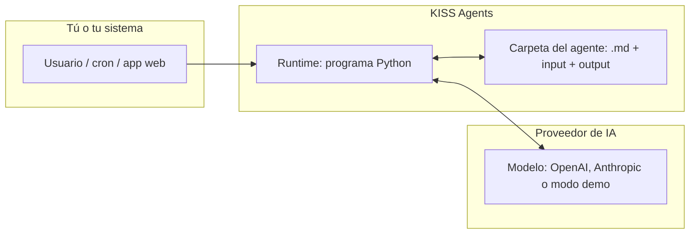
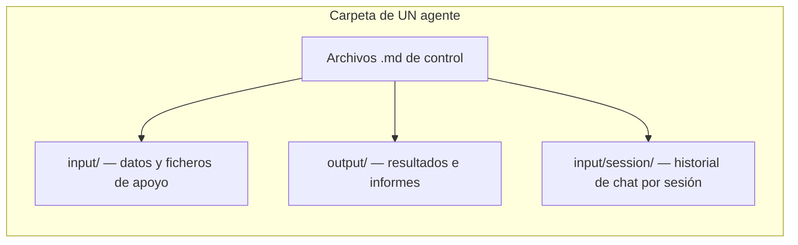
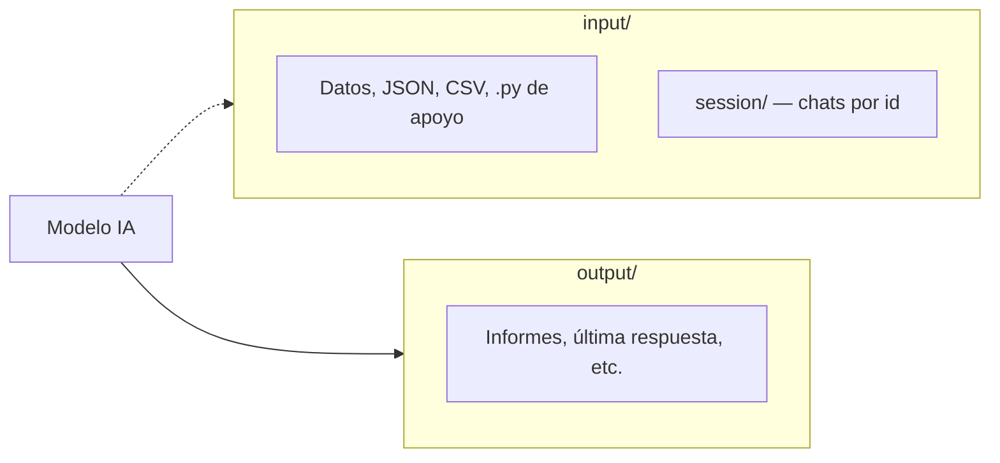
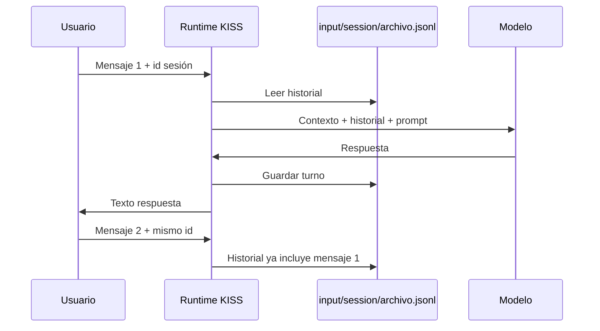
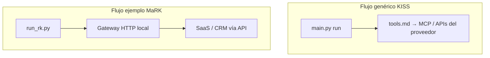
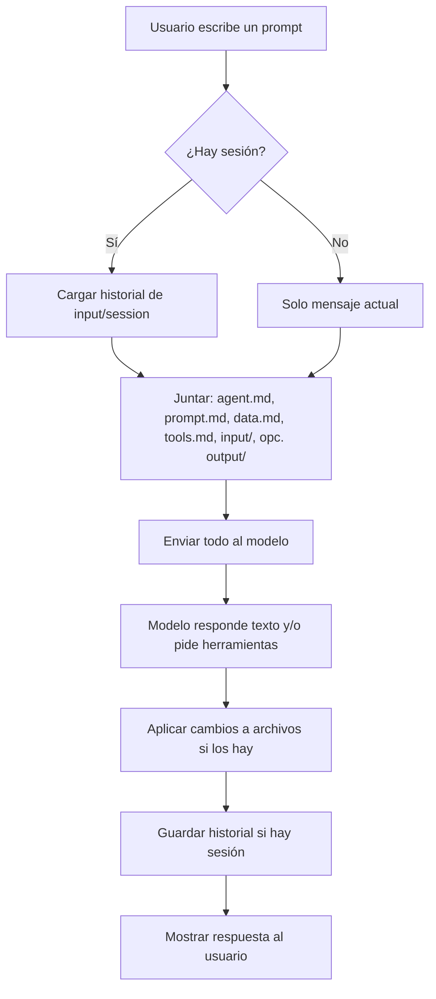

# KISS Agents — Tutorial para todos

Esta guía está pensada para **cualquier persona** que quiera entender qué es KISS Agents y cómo se usa, **sin saber programar**. Si en algún momento aparece un comando de terminal, lo explicamos paso a paso.

---

## 1. Empieza aquí: de qué va esto en 30 segundos

**KISS Agents** es una forma de tener **asistentes configurados con archivos de texto** (sobre todo Markdown, extensión `.md`) dentro de una **carpeta**.

- Esa carpeta es el **“cerebro” y la memoria”** del asistente para ese caso concreto.
- Un programa pequeño (**runtime**) lee esos archivos, se los envía a un **modelo de inteligencia artificial** y guarda las respuestas o los cambios que el modelo indique.
- No hace falta base de datos propia del producto: **el estado vive en la carpeta** (archivos).

**Analogía simple:** imagina un **empleado** que solo trabaja con lo que hay en **su archivador** (la carpeta del agente). Tú preparas las instrucciones y los datos en carpetas y ficheros; el runtime es quien “lleva y trae” papeles entre el archivador y el modelo.



---

## 2. Un agente = una carpeta

Cada **agente** es **un directorio** con un conjunto de archivos. Ejemplos que ya vienen en el proyecto:

| Carpeta de ejemplo | Idea en una frase |
|--------------------|-------------------|
| `daily-email-summary` | Ayudar a preparar un **resumen de correo** (demo). |
| `rkiglesias` | Asistente tipo **MaRK** (compradores / inmobiliaria) con herramientas de negocio. |
| `hopx-demo` | Demo de integración con herramientas vía **MCP**. |

La ruta típica dentro del repo es:

`KISS Agents/local/examples/<nombre-del-agente>/`



---

## 3. Los archivos `.md` principales: para qué sirve cada uno

El programa que carga el agente busca **por nombre** varios Markdown “canónicos”. No tienes que usarlos todos; si un archivo **no existe** o está **vacío**, simplemente se omite.

### Tabla rápida

| Archivo | Para qué sirve (lenguaje sencillo) |
|---------|-----------------------------------|
| **`agent.md`** | **Quién es** el asistente: nombre, rol, tono y objetivos en pocas líneas. Es la “ficha de presentación” del agente. |
| **`prompt.md`** | **Cómo debe comportarse** en detalle: reglas, flujos, qué puede y qué no debe hacer. Suele ser el archivo más largo. |
| **`tools.md`** | **Qué herramientas externas** puede usar el modelo (por ejemplo conexión a servidores MCP). Suele incluir un bloque **JSON** con la configuración técnica. |
| **`data.md`** | **Datos de contexto** que no son instrucciones: producto, enlaces públicos, nombres de marca, textos legales breves, etc. |
| **`done.md`** | **Criterio de “trabajo terminado”** o checklist para que el modelo sepa cuándo dar por cerrada una tarea. |
| **`memory.md`** | **Memoria persistente** que el propio flujo puede ir actualizando (hechos acordados, preferencias). Es opcional y se puede rellenar a mano o vía bloques especiales en la respuesta del modelo. |
| **`steps.md`** | **Pasos** o guiones fijos (tipo checklist) si quieres que el agente siga una secuencia clara. |
| **`schedule.md`** | **Cuándo** debe “despertarse” el agente de forma automática (expresión tipo cron, zona horaria, instrucción a ejecutar). |

### Un poco más de detalle (sin tecnicismos)

- **`agent.md`**  
  Piensa en la **primera página** del manual del empleado: “Eres el asistente X de la empresa Y; hablas en español; eres breve y profesional”.

- **`prompt.md`**  
  Es el **procedimiento operativo**: “Si el usuario pregunta por precios, mira en data.md; no inventes cifras; si falta un dato, pregunta solo una cosa cada vez”.

- **`tools.md`**  
  Aquí se dice **si puede llamar a sistemas externos** (calendario, CRM, búsqueda, etc.). Para alguien no técnico: es la lista de **“teléfonos”** a los que el asistente puede marcar, definida en un formato que entiende la IA (a menudo JSON dentro del mismo Markdown).

- **`data.md`**  
  **Hechos y textos** que quieres que el modelo tenga siempre presentes sin mezclarlos con las reglas de comportamiento.

- **`done.md`**  
  Útil cuando quieres **ciclos de trabajo** claros: “Cuando tengas el resumen en output y memory actualizado, considera la tarea cerrada”.

- **`memory.md`**  
  Para **recordar** cosas entre ejecuciones (siempre dentro de lo que tú decidas guardar). En conversaciones largas también puede ayudar a no repetir preguntas.

- **`steps.md`**  
  Cuando el proceso es **siempre el mismo** (paso 1, 2, 3…).

- **`schedule.md`**  
  Para **automatizar**: “cada lunes a las 9:00 (Madrid), ejecuta esto”. El reloj real lo pone **cron** en el servidor o un disparador HTTP periódico; KISS no mantiene un daemon complicado.

---

## 4. Carpetas `input/` y `output/`

### `input/`

- Aquí van **datos de entrada**: JSON de definición de herramientas, CSV de ejemplo, scripts de ayuda en Python, notas, etc.
- **Importante:** la subcarpeta **`input/session/`** guarda el **historial de chat** por sesión (un fichero por id de sesión). El runtime **no** mezcla ese historial con el resto del contexto como si fuera un archivo normal de lectura del agente; lo gestiona aparte para las conversaciones.

### `output/`

- Aquí aparecen **resultados**: última respuesta resumida, informes generados, archivos que el modelo pida escribir con la convención `kiss-write`, etc.
- Es el sitio donde **miras** lo que el agente “dejó hecho” en disco después de una ejecución.



---

## 5. Tres formas de “ejecutar” un agente

Todo esto asume que tienes **Python instalado** y estás en la carpeta correcta del proyecto (tu compañero técnico puede dejarte el comando exacto).

### 5.1. Una sola vez desde la terminal (“run”)

**Idea:** le das una **instrucción en texto** y el agente responde una vez.

Ejemplo (modo demo, sin gastar API de pago):

```bash
cd "KISS Agents/local/runtime"
python3 main.py run ../examples/daily-email-summary "Genera el resumen de correo de hoy"
```

- **`run`** = ejecutar ahora.
- **`../examples/daily-email-summary`** = qué carpeta de agente usar.
- El texto entre comillas = lo que “pide” el usuario.

### 5.2. Servidor web pequeño (“serve”)

**Idea:** dejas un **servicio** escuchando; otras aplicaciones o `curl` pueden pedir **ejecutar un agente** por HTTP.

```bash
cd "KISS Agents/local/runtime"
python3 main.py serve
```

Luego, por ejemplo, se puede llamar a la API de **run** con un JSON (esto suele hacerlo un desarrollador desde otra herramienta).

### 5.3. Tick programado (“tick” + `schedule.md`)

**Idea:** recorrer agentes que tengan **`schedule.md`** y ejecutar los que toquen **según la hora** (comparación sencilla con cron).

- Puede lanzarse **a mano**: `python3 main.py tick`
- O en **producción** suele combinarse con **cron** que cada X minutos llame al servidor o ejecute `tick`.

En `schedule.md` suele haber campos como **cron**, **zona horaria** y **qué debe hacer** el agente cuando salta la alarma.

---

## 6. Conversaciones con memoria (“sesión”)

Si quieres que el asistente **recuerde** los mensajes anteriores **del mismo chat**, usas un **identificador de sesión** (un nombre o código que tú eliges).

Ejemplo:

```bash
cd "KISS Agents/local/runtime"
python3 main.py run ../examples/rkiglesias "Hola, busco piso en Oviedo" --session maria-2026-04
```

La próxima vez:

```bash
python3 main.py run ../examples/rkiglesias "Prefiero tres dormitorios" --session maria-2026-04
```

Los mensajes se guardan en algo como:

`.../rkiglesias/input/session/maria-2026-04.jsonl`

Así, **María** mantiene el hilo aunque tú cierres la terminal entre una frase y otra.



---

## 7. “Cerebros” disponibles: stub, OpenAI y Anthropic

| Modo | Qué es | Para qué sirve |
|------|--------|----------------|
| **Stub (por defecto)** | Respuesta **fija de demostración**, sin llamar a internet a un modelo de pago. | Probar que la carpeta, el cron y los archivos están bien. |
| **OpenAI** | Usa la API de **OpenAI** (modelos tipo GPT). | Producción con herramientas avanzadas según configuración. |
| **Anthropic** | Usa la API de **Anthropic** (modelos Claude). | Igual, otro proveedor. |

Quien despliegue el sistema configura **variables de entorno** (pequeñas “palabras clave” con la clave API, etc.). Si no configuras nada, suele quedarse en **stub**.

**Importante para no técnicos:** el **contenido** del agente (tus `.md`) es independiente del proveedor; cambiar de stub a OpenAI no obliga a reescribir toda la carpeta, solo a **activar** el modo y las claves.

---

## 8. Herramientas externas (CRM, búsquedas, etc.)

Hay **dos ideas** que conviene no mezclar:

### A) Herramientas vía **KISS estándar** (`main.py` + `tools.md`)

- En **`tools.md`** se declara el JSON de **MCP** u otras integraciones que el **runtime genérico** sabe pasar al proveedor (OpenAI Responses, Anthropic Messages).
- Sirve cuando tu integración encaja con ese modelo.

### B) Herramientas vía **gateway HTTP** (ejemplo MaRK: `run_rk.py`)

El agente **rkiglesias** tiene un flujo especial documentado en su carpeta:

- Un **servidor gateway** en Python recibe llamadas tipo “ejecuta la herramienta X con estos datos”.
- Ese gateway puede estar en **modo demo** o conectado a la **API real** del producto (variables `KISS_SAAS_API_BASE_URL`, etc.).

Para alguien de negocio: es el mismo concepto (“el asistente puede **hacer cosas** en sistemas reales”), pero el **camino técnico** es distinto al del `main.py` genérico. Los detalles están en **`CONEXION.md`** dentro de esa carpeta de agente.



---

## 9. Ejemplos ilustrativos

### Ejemplo 1: Probar sin gastar API (stub)

**Objetivo:** ver que todo “enciende”.

1. Abre terminal en `KISS Agents/local/runtime`.
2. Ejecuta:

   `python3 main.py run ../examples/daily-email-summary "Haz un resumen ficticio"`

3. Mira en `examples/daily-email-summary/output/` si apareció un archivo tipo `stub-last.md`.

**Qué aprendes:** el **ciclo carpeta → runtime → respuesta en output** funciona.

---

### Ejemplo 2: Misma conversación en dos mensajes (sesión)

**Objetivo:** ver la **memoria de chat** entre dos frases.

1. `python3 main.py run ../examples/rkiglesias "Solo di hola" --session demo-ana`
2. `python3 main.py run ../examples/rkiglesias "¿Recuerdas mi primer mensaje?" --session demo-ana`

**Qué aprendes:** el segundo mensaje puede usar el historial guardado en **`input/session/demo-ana.jsonl`**.

*(Si el modelo está en stub, la respuesta seguirá siendo muy simple; con OpenAI/Anthropic la diferencia se nota más.)*

---

### Ejemplo 3: Agente que “debe despertarse” solo

**Objetivo:** entender **`schedule.md`**.

1. Abre `examples/daily-email-summary/schedule.md` (o el agente que uses).
2. Verás algo como una expresión **cron** y una zona horaria.
3. Con el **servidor** en marcha y **cron** del sistema llamando a `tick` (o el endpoint equivalente), en la hora indicada el sistema intentará ejecutar la instrucción definida.

**Qué aprendes:** KISS **no** es un cron interno pesado; se apoya en **disparadores externos** + **`schedule.md`** como calendario de intenciones.

---

### Ejemplo 4: Escribir en memoria o en informes (`kiss-write`)

Cuando el proveedor de IA está configurado para ello, el modelo puede incluir en su respuesta bloques especiales que el runtime traduce en **“escribe este archivo con este contenido”**. Eso permite actualizar **`memory.md`** o crear informes en **`output/`** sin que tú copies y pegues a mano.

Los detalles del formato están en la documentación técnica de **contratos** (`local/docs/contracts.md`).

---

## 10. Diagrama mental: de un mensaje del usuario al resultado



---

## 11. Preguntas frecuentes

**¿Necesito saber programar para redactar un agente?**  
No para **editar** `agent.md`, `prompt.md`, `data.md` y muchos contenidos de `input/`. Sí hace falta ayuda técnica para **instalar Python**, **cron**, **claves API** y **servidores** (gateway, MCP).

**¿Dónde está el “código” del agente?**  
En la práctica, **en los `.md` y los datos** de la carpeta. El runtime es **genérico** y no contiene reglas de tu negocio.

**¿Puedo tener muchos agentes?**  
Sí: **una carpeta por agente** (como los ejemplos bajo `local/examples/`).

**¿Se pierde el historial?**  
Si no usas **sesión**, cada `run` es más “aislado”. Con **`--session`**, el historial vive en **`input/session/`** hasta que alguien borre esos archivos.

**¿Es seguro poner secretos en los .md?**  
**No.** Contraseñas y tokens deben ir en **variables de entorno** o gestores de secretos. En `tools.md` solo deberían aparecer **URLs públicas** o referencias; las claves, fuera del repo.

---

## 12. Dónde seguir (documentación más técnica)

| Documento | Contenido |
|-----------|-----------|
| [`../local/README.md`](../local/README.md) | Comandos rápidos, Python, proveedores. |
| [`../local/docs/philosophy.md`](../local/docs/philosophy.md) | Filosofía y límites del diseño. |
| [`../local/docs/adapters.md`](../local/docs/adapters.md) | OpenAI / Anthropic y variables. |
| [`../local/docs/contracts.md`](../local/docs/contracts.md) | Formato `kiss-write` y writes. |
| [`../local/docs/operations.md`](../local/docs/operations.md) | Pruebas, cron, conteo de líneas. |
| [`../local/docs/mcp-hopx.md`](../local/docs/mcp-hopx.md) | MCP tipo Hopx y Worker. |
| [`../local/examples/rkiglesias/CONEXION.md`](../local/examples/rkiglesias/CONEXION.md) | MaRK + gateway + API SaaS. |

---

## 13. Resumen en una frase

**KISS Agents** te permite definir **asistentes** como **carpetas de Markdown y datos**, ejecutarlos **a mano, por HTTP o con el reloj del sistema**, y opcionalmente conectarlos a **IA real** y **herramientas externas**, sin convertir tu proyecto en un monstruo de librerías y bases de datos solo para orquestar agentes.

Si algo de esta guía no cuadra con lo que ves en tu copia del repositorio, puede haber cambiado una ruta o un nombre de comando: pide a quien mantenga el proyecto que **actualice** este tutorial o la sección afectada.
